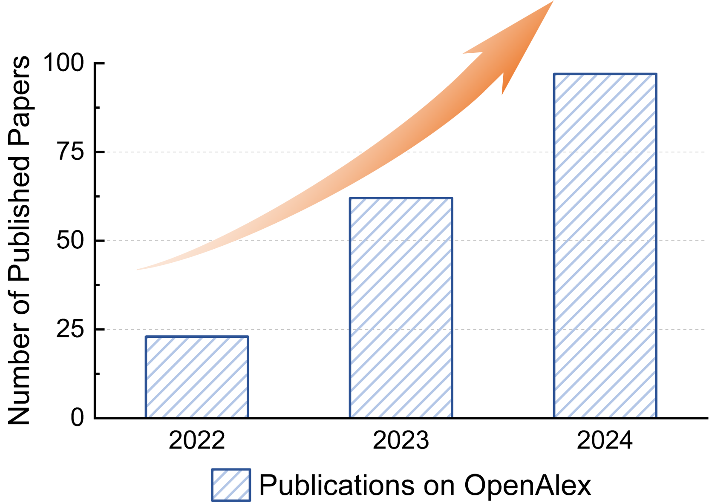
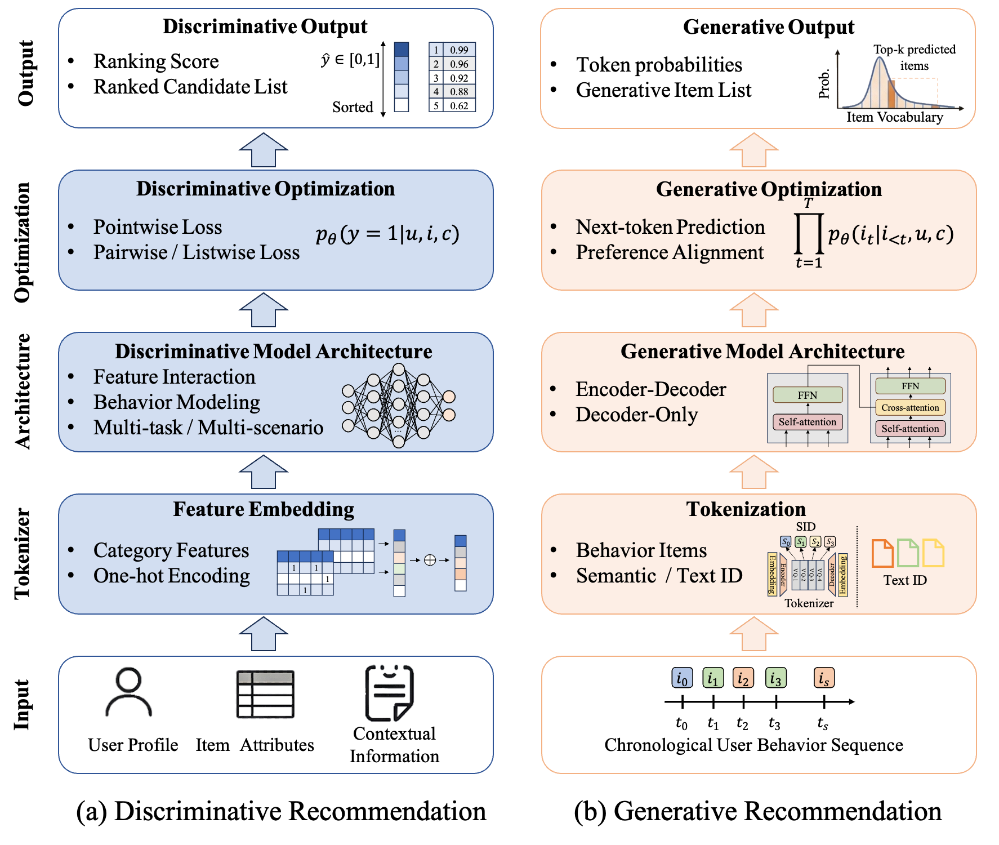

# A Survey of Generative Recommendation from a Tri-Decoupled Perspective: Tokenization,Architecture, and Optimization


## Overview

This is the official repository of the paper ["*A Survey of Generative Recommendation from a Tri-Decoupled Perspective: Tokenization,Architecture, and Optimization*"](https://arxiv.org/abs/2406.01171)

This paper provides an in-depth survey on the latest advancements in generative recommendation systems, focusing on key components such as tokenization, architecture design, and optimization strategies. It explores the paradigm shift from traditional discriminative models to generative models and their potential to revolutionize recommendation systems across various industries.

We continuously maintain this paper collection to foster future endeavors.

## Citation
If you find this survey useful, please cite the following paper:

```bibtex
@misc{your2025generative,
  title={Generative Recommendation Systems: A Comprehensive Survey},
  author={Your Name and Collaborators},
  year={2025},
  eprint={your-arxiv-id},
  archivePrefix={arXiv},
  primaryClass={cs.IR},
}
```


## Table of Contents
- [Introduction](#introduction)
- [Survey Scope](#survey-scope)
- [Key Components](#key-components)
  - [Tokenization](#tokenization)
  - [Architecture Design](#architecture-design)
  - [Optimization Strategies](#optimization-strategies)
- [Applications](#applications)
  - [Cascaded System](#cascaded-system)
  - [Industrial Scenarios](#industrial-scenarios)
<!-- - [Future Direction](#future-direction) -->
- [Acknowledgement](#acknowledgement)
- [How to Contribute](#how-to-contribute)
<!-- - [Citation](#citation) -->
<!-- - [Authors](#authors) -->

## Introduction
Generative recommendation systems mark a fundamental shift from scoring candidates to directly generating item identifiers, eliminating cascading errors in multi-stage pipelines. This survey uniquely frames this evolution through a Tri-Decoupled Perspective—Tokenization (evolving from sparse IDs to semantic identifiers), Architecture (unified, scalable backbones achieving higher MFU), and Optimization (combining supervised next-token prediction and RL-based preference alignment). By systematically disentangling these three foundational components, we reveal how independent innovations converge to drive the generative paradigm, providing researchers and practitioners with both a comprehensive conceptual framework and actionable blueprint for building next-generation recommender systems.

<!-- - Number of publications on generative recommendation indexed in OpenAlex
 -->

- Generative VS Discriminative



## Survey Scope
This survey covers a wide range of topics relevant to generative recommendation systems, including:
- The transition from discriminative to generative models.
- Detailed analysis of tokenization, including sparse ID, text-based, and semantic ID approaches.
- Architectural frameworks like encoder-decoder, decoder-only, and diffusion-based models.
- Optimization techniques, such as supervised learning and preference alignment.

## Key Components

### Tokenization 🔍
Generative recommendation systems benefit significantly from the tokenization of items and user interactions. We explore three main tokenization strategies:
- **Sparse ID-based Tokenization:** Traditional approach but limited in semantics.

|  Method   |                                             Paper Title                                              |   Published At    |                                                                                                                                  Code                                                                                                                                  |
| :-------: | :--------------------------------------------------------------------------------------------------: | :---------------: | :--------------------------------------------------------------------------------------------------------------------------------------------------------------------------------------------------------------------------------------------------------------------: |
| *GRU4Rec* |      [Session-based Recommendations with Recurrent Neural Networks](https://arxiv.org/abs/1511.06939)      | ICLR'16 |                        [](https://github.com/hidasib/GRU4Rec)
| *SASRec* |      [Self-Attentive Sequential Recommendation](https://arxiv.org/abs/1808.09781)      | ICDM'18 |                        [](https://github.com/kang205/SASRec)
| *BERT4Rec* |      [BERT4Rec: Sequential Recommendation with Bidirectional Encoder Representations from Transformer](https://arxiv.org/abs/1904.06690)      | CIKM'19 |                        [](https://github.com/FeiSun/BERT4Rec)
| *HSTU* |      [Actions Speak Louder than Words: Trillion-Parameter Sequential Transducers for Generative Recommendations](https://arxiv.org/abs/2402.17152)      | ICML'24 |                        [](https://github.com/meta-recsys/generative-recommenders)                        |
| *LUM* |      [Unlocking Scaling Law in Industrial Recommendation Systems with a Three-step Paradigm based Large User Model](https://arxiv.org/abs/2502.08309)      | arXiv'25 |                        /
| *MTGR* |      [MTGR: Industrial-Scale Generative Recommendation Framework in Meituan](https://arxiv.org/abs/2505.18654)      | CIKM '25 |                        /                        |
| *PinRec* |      [PinRec: Outcome-Conditioned, Multi-Token Generative Retrieval for Industry-Scale Recommendation Systems](https://arxiv.org/abs/2504.10507)      | arXiv '25 |                        /                        |
| *DFGR* |      [Action is All You Need: Dual-Flow Generative Ranking Network for Recommendation](https://www.arxiv.org/abs/2505.16752)      | arXiv '25 |                        /                        |
| *GenRank* |      [Towards Large-scale Generative Ranking](https://arxiv.org/abs/2505.04180)      | arXiv '25 |                        /                        |

- **Text-based Tokenization:** Leverages the power of natural language models, improving semantic understanding.

|  Method   |                                             Paper Title                                              |   Published At    |                                                                                                                                  Code                                                                                                                                  |
| :-------: | :--------------------------------------------------------------------------------------------------: | :---------------: | :--------------------------------------------------------------------------------------------------------------------------------------------------------------------------------------------------------------------------------------------------------------------: |
| *P5* |      [Recommendation as Language Processing (RLP): A Unified Pretrain, Personalized Prompt & Predict Paradigm (P5)](https://arxiv.org/abs/2203.13366)      | RecSys'22 |                        [](https://github.com/jeykigung/P5)
| *M6-Rec* |      [M6-Rec: Generative Pretrained Language Models are Open-Ended Recommender Systems](https://arxiv.org/abs/2205.08084)      | KDD'22 |                        /
| *GPT4Rec* |      [GPT4Rec: A Generative Framework for Personalized Recommendation and User Interests Interpretation](https://arxiv.org/abs/2304.03879)      | arXiv'23 |                        /
| *RecSysLLM* |      [Leveraging Large Language Models for Pre-trained Recommender Systems](https://arxiv.org/abs/2308.10837)      | arXiv'23 |                        /
| *TALLRec* |      [TALLRec: An Effective and Efficient Tuning Framework to Align Large Language Model with Recommendation](https://arxiv.org/abs/2305.00447)      | RecSys'23 |                        [](https://github.com/SAI990323/TALLRec)
| *GenRec* |      [GenRec: Large Language Model for Generative Recommendation](https://arxiv.org/abs/2307.00457)      | ECIR'24 |                        /
| *LLaRA* |      [LLaRA: Large Language-Recommendation Assistant](https://arxiv.org/abs/2312.02445)      | SIGIR'24 |                        [](https://github.com/ljy0ustc/LLaRA)
| *HLLM* |      [HLLM: Enhancing Sequential Recommendations via Hierarchical Large Language Models for Item and User Modeling](https://arxiv.org/abs/2409.12740)      | arXiv'24 |                        [](https://github.com/bytedance/HLLM)
| *S-DPO* |      [On Softmax Direct Preference Optimization for Recommendation](https://arxiv.org/abs/2406.09215)      | NeurIPS'24 |                 [](https://github.com/chenyuxin1999/S-DPO) 
| *InteraRec* |      [InteraRec: Screenshot Based Recommendations Using Multimodal Large Language Models](https://arxiv.org/abs/2403.00822)      | arXiv'24 |                /
| *LLMTreeRec* |      [LLMTreeRec: Unleashing the Power of Large Language Models for Cold-Start Recommendations](https://arxiv.org/abs/2404.00702)      | COLING'25 |                        [](https://github.com/Applied-Machine-Learning-Lab/LLMTreeRec)
| *BIGRec* |      [A Bi-Step Grounding Paradigm for Large Language Models in Recommendation Systems](https://arxiv.org/abs/2308.08434)      | TORS'25 |                        [](https://github.com/SAI990323/BIGRec)
| *Rec-R1* |      [Rec-R1: Bridging Generative Large Language Models and User-Centric Recommendation Systems via Reinforcement Learning](https://arxiv.org/abs/2503.24289)      | TMLR'25 |                        [](https://github.com/linjc16/Rec-R1)
| *RecFound* |      [Generative Representational Learning of Foundation Models for Recommendation](https://arxiv.org/abs/2506.11999)      | arXiv'25 |                        [](https://github.com/JunkFood436/RecFound)


- **Semantic ID-based Tokenization:** Combines the best of both worlds with efficient, semantic-rich representations.

|  Method   |                                             Paper Title                                              |   Published At    |                                                                                                                                  Code                                                                                                                                  |
| :-------: | :--------------------------------------------------------------------------------------------------: | :---------------: | :--------------------------------------------------------------------------------------------------------------------------------------------------------------------------------------------------------------------------------------------------------------------: |
| *TIGER* |      [Recommender systems with generative retrieval](https://arxiv.org/abs/2305.05065)      | NeurIPS'23 |                        /
| *LC-Rec* |      [Adapting Large Language Models by Integrating Collaborative Semantics for Recommendation](https://arxiv.org/abs/2311.09049)      | ICDE'24 |                        [](https://github.com/RUCAIBox/LC-Rec)
| *LMIndexer* |      [Language Models As Semantic Indexers](https://arxiv.org/abs/2310.07815)      | ICML'24 |                        [](https://github.com/PeterGriffinJin/LMIndexer)
| *TokenRec* |      [TokenRec: Learning to Tokenize ID for LLM-based Generative Recommendation](https://arxiv.org/abs/2406.10450)      | TKDE'24 |                 [](https://github.com/Quhaoh233/TokenRec)     
| *LETTER* |      [Learnable Item Tokenization for Generative Recommendation](https://arxiv.org/abs/2405.07314)      | CIKM'24 |                        [](https://github.com/HonghuiBao2000/LETTER)
| *EAGER* |      [EAGER: Two-Stream Generative Recommender with Behavior-Semantic Collaboration](https://arxiv.org/abs/2406.14017)      | KDD'24 |                        [](https://github.com/yewzz/EAGER)
| *ETEGRec* |      [Generative Recommender with End-to-End Learnable Item Tokenization](https://arxiv.org/abs/2409.05546)      | SIGIR'25 |                        [](https://github.com/RUCAIBox/ETEGRec)
| *OneRec* |      [OneRec: Unifying Retrieve and Rank with Generative Recommender and Iterative Preference Alignment](https://arxiv.org/abs/2502.18965)      | arXiv'25 |                       /
| *OneRec-V2* |      [OneRec-V2 Technical Report](https://arxiv.org/abs/2508.20900)      | arXiv'25 |                       /
| *BBQRec* |      [BBQRec: Behavior-Bind Quantization for Multi-Modal Sequential Recommendation](https://arxiv.org/abs/2504.06636)      | arXiv'25 |                       /
| *OneLoc* |      [OneLoc: Geo-Aware Generative Recommender Systems for Local Life Service](https://arxiv.org/abs/2508.14646)      | arXiv'25 |                 /
| *OneSearch* |      [OneSearch: A Preliminary Exploration of the Unified End-to-End Generative Framework for E-commerce Search](https://arxiv.org/abs/2509.03236)      | arXiv'25 |                       /
| *RPG* |      [Generating Long Semantic IDs in Parallel for Recommendation](https://arxiv.org/abs/2506.05781)      | KDD'25 |                   [](https://github.com/facebookresearch/RPG_KDD2025)   
| *URI* |      [Making Transformer Decoders Better Differentiable Indexers](https://openreview.net/pdf?id=bePaRx0otZ)      | ICLR'25 |                /
| *EAGER-LLM* |      [EAGER-LLM: Enhancing Large Language Models as Recommenders through Exogenous Behavior-Semantic Integration](https://arxiv.org/abs/2502.14735)      | WWW'25 |                /
| *UNGER* |      [UNGER: Generative Recommendation with A Unified Code via Semantic and Collaborative Integration](https://arxiv.org/abs/2502.06269)      | TOIS'25 |                /
| *RecGPT* |      [RecGPT: A Foundation Model for Sequential Recommendation](https://arxiv.org/abs/2506.06270)      | EMNLP'25 |                 [](https://github.com/hkuds/recgpt)   
| *MMQ* |      [MMQ: Multimodal Mixture-of-Quantization Tokenization for Semantic ID Generation and User Behavioral Adaptation](https://arxiv.org/abs/2508.15281)      | arXiv'25 |                /
| *MME-SID* |      [Empowering Large Language Model for Sequential Recommendation via Multimodal Embeddings and Semantic IDs](https://arxiv.org/abs/2509.02017)      | CIKM'25 |                 [](https://github.com/Applied-Machine-Learning-Lab/MME-SID)   
| *GNPR-SID* |      [Generative Next POI Recommendation with Semantic ID](https://arxiv.org/abs/2506.01375)      | KDD'25 |                 [](https://github.com/wds1996/GNPR-SID)     
| *COBRA* |      [Sparse Meets Dense: Unified Generative Recommendations with Cascaded Sparse-Dense Representations](https://arxiv.org/abs/2503.02453)      | arXiv'25 |                /  
| *GFlowGR* |      [GFlowGR: Fine-tuning Generative Recommendation Frameworks with Generative Flow Networks](https://arxiv.org/abs/2506.16114)      | arXiv'25 |                /  
| *STREAM-Rec* |      [Slow Thinking for Sequential Recommendation](https://arxiv.org/abs/2504.09627)      | arXiv'25 |                /  
| *AtSpeed* |      [Efficient Inference for Large Language Model-based Generative Recommendation](https://arxiv.org/abs/2410.05165)      | ICLR'25 |                 [](https://github.com/Linxyhaha/AtSpeed) 
| *RecBase* |      [RecBase: Generative Foundation Model Pretraining for Zero-Shot Recommendation](https://arxiv.org/abs/2509.03131)      | EMNLP'25 |                /  
| *GMC* |      [Generative Multi-Target Cross-Domain Recommendation](https://arxiv.org/abs/2507.12871)      | arXiv'25 |                /  
| *SaviorRec* |      [SaviorRec: Semantic-Behavior Alignment for Cold-Start Recommendation](https://arxiv.org/abs/2508.01375)      | arXiv'25 |                /  
| *TALKPLAY* |      [TALKPLAY: Multimodal Music Recommendation with Large Language Models](https://arxiv.org/abs/2502.13713)      | arXiv'25 |                /  
| *CAR* |      [Act-With-Think: Chunk Auto-Regressive Modeling for Generative Recommendation](https://arxiv.org/abs/2506.23643)      | arXiv'25 |                /  
| *QARM* |      [QARM: Quantitative Alignment Multi-Modal Recommendation at Kuaishou](https://arxiv.org/abs/2411.11739)      | CIKM'25 |                /  
| *EGA-V2* |      [EGA-V2: An End-to-end Generative Framework for Industrial Advertising](https://arxiv.org/abs/2505.17549)      | arXiv'25 |           /  
| *PLUM* |      [PLUM: Adapting Pre-trained Language Models for Industrial-scale Generative Recommendations](https://arxiv.org/abs/2510.07784)      | arXiv'25 |                /  
| *OneRec-Think* |      [OneRec-Think: In-Text Reasoning for Generative Recommendation](https://arxiv.org/abs/2510.11639)      | arXiv'25 |                /  
| *SpecGR* |      [Inductive Generative Recommendation via Retrieval-based Speculation](https://arxiv.org/abs/2410.02939)      | AAAI'26 |                 [](https://github.com/Jamesding000/SpecGR) 


### Architecture Design 🏠
Generative recommender systems typically employ *Encoder-Decoder* architectures, *Decoder-Only* architectures, and *Diffusion* architectures. Compared to traditional methods, these architectures offer higher scalability and computational efficiency.
<!-- Generative recommendation systems often utilize encoder-decoder and decoder-only architectures. These structures enable scalability and better computational efficiency compared to traditional methods. The evolution of architectures from simple MLP models to large transformer-based models is covered. -->

- **Encoder-Decoder:**

|  Method   |                                             Paper Title                                              |   Published At    |                                                                                                                                  Code                                                                                                                                
| :-------: | :--------------------------------------------------------------------------------------------------: | :---------------: | :--------------------------------------------------------------------------------------------------------------------------------------------------------------------------------------------------------------------------------------------------------------------: |
| *P5* |      [Recommendation as Language Processing (RLP): A Unified Pretrain, Personalized Prompt & Predict Paradigm (P5)](https://arxiv.org/abs/2203.13366)      | RecSys'22 |                        [](https://github.com/jeykigung/P5)
| *M6-Rec* |      [M6-Rec: Generative Pretrained Language Models are Open-Ended Recommender Systems](https://arxiv.org/abs/2205.08084)      | KDD'22 |                        /
| *RecSysLLM* |      [Leveraging Large Language Models for Pre-trained Recommender Systems](https://arxiv.org/abs/2308.10837)      | arXiv'23 |                        /
| *TIGER* |      [Recommender systems with generative retrieval](https://arxiv.org/abs/2305.05065)      | NeurIPS'23 |                        /
| *OneRec* |      [OneRec: Unifying Retrieve and Rank with Generative Recommender and Iterative Preference Alignment](https://arxiv.org/abs/2502.18965)      | arXiv'25 |                       / 
| *OneSug* |      [OneSug: The Unified End-to-End Generative Framework for E-commerce Query Suggestion](https://arxiv.org/abs/2506.06913)      | arXiv'25 |                       / 
| *OneSearch* |      [OneSearch: A Preliminary Exploration of the Unified End-to-End Generative Framework for E-commerce Search](https://arxiv.org/abs/2509.03236)      | arXiv'25 |                       /
| *OneLoc* |      [OneLoc: Geo-Aware Generative Recommender Systems for Local Life Service](https://arxiv.org/abs/2508.14646)      | arXiv'25 |                 /
| *EGA-V2* |      [EGA-V2: An End-to-end Generative Framework for Industrial Advertising](https://arxiv.org/abs/2505.17549)      | arXiv'25 |           /  


- **Decoder-Only:**

|  Method   |                                             Paper Title                                              |   Published At    |                                                                                                                                  Code                                                                                                                                 
| :-------: | :--------------------------------------------------------------------------------------------------: | :---------------: | :--------------------------------------------------------------------------------------------------------------------------------------------------------------------------------------------------------------------------------------------------------------------: | 
| *GPT4Rec* |      [GPT4Rec: A Generative Framework for Personalized Recommendation and User Interests Interpretation](https://arxiv.org/abs/2304.03879)      | arXiv'23 |                        /
| *GPTRec* |      [Generative Sequential Recommendation with GPTRec](https://arxiv.org/abs/2306.11114)      | arXiv'23 |                        /
| *HSTU* |      [Actions Speak Louder than Words: Trillion-Parameter Sequential Transducers for Generative Recommendations](https://arxiv.org/abs/2402.17152)      | ICML'24 |                        [](https://github.com/meta-recsys/generative-recommenders)   
| *HLLM* |      [HLLM: Enhancing Sequential Recommendations via Hierarchical Large Language Models for Item and User Modeling](https://arxiv.org/abs/2409.12740)      | arXiv'24 |                        [](https://github.com/bytedance/HLLM)                    
| *GenRec* |      [GenRec: Large Language Model for Generative Recommendation](https://arxiv.org/abs/2307.00457)      | ECIR'24 |                        /
| *Llama4Rec* |      [Integrating Large Language Models into Recommendation via Mutual Augmentation and Adaptive Aggregation](https://arxiv.org/abs/2401.13870)      | arXiv'24 |    /
| *HSTU* |      [Actions Speak Louder than Words: Trillion-Parameter Sequential Transducers for Generative Recommendations](https://arxiv.org/abs/2402.17152)      | ICML'24 |                        [](https://github.com/meta-recsys/generative-recommenders)    
| *LC-Rec* |      [Adapting Large Language Models by Integrating Collaborative Semantics for Recommendation](https://arxiv.org/abs/2311.09049)      | ICDE'24 |                        [](https://github.com/RUCAIBox/LC-Rec)
| *BIGRec* |      [A Bi-Step Grounding Paradigm for Large Language Models in Recommendation Systems](https://arxiv.org/abs/2308.08434)      | TORS'25 |                        [](https://github.com/SAI990323/BIGRec)
| *OneRec-V2* |      [OneRec-V2 Technical Report](https://arxiv.org/abs/2508.20900)      | arXiv'25 |    /
| *Rec-R1* |      [Rec-R1: Bridging Generative Large Language Models and User-Centric Recommendation Systems via Reinforcement Learning](https://arxiv.org/abs/2503.24289)      | TMLR'25 |                        [](https://github.com/linjc16/Rec-R1)
| *RecFound* |      [Generative Representational Learning of Foundation Models for Recommendation](https://arxiv.org/abs/2506.11999)      | arXiv'25 |                        [](https://github.com/JunkFood436/RecFound)
| *SPRec* |      [SPRec: Self-Play to Debias LLM-based Recommendation](https://arxiv.org/abs/2412.09243)      | WWW'25 |                        [](https://github.com/RegionCh/SPRec)
| *TALKPLAY* |      [TALKPLAY: Multimodal Music Recommendation with Large Language Models](https://arxiv.org/abs/2502.13713)      | arXiv'25 |                /  
| *LUM* |      [Unlocking Scaling Law in Industrial Recommendation Systems with a Three-step Paradigm based Large User Model](https://arxiv.org/abs/2502.08309)      | arXiv'25 |                        /
| *EAGER-LLM* |      [EAGER-LLM: Enhancing Large Language Models as Recommenders through Exogenous Behavior-Semantic Integration](https://arxiv.org/abs/2502.14735)      | WWW'25 |                /
| *LiGR* |      [From Features to Transformers: Redefining Ranking for Scalable Impact](https://arxiv.org/abs/2502.03417)      | arXiv'25 |                /
| *COBRA* |      [Sparse Meets Dense: Unified Generative Recommendations with Cascaded Sparse-Dense Representations](https://arxiv.org/abs/2503.02453)      | arXiv'25 |                /  
| *MME-SID* |      [Empowering Large Language Model for Sequential Recommendation via Multimodal Embeddings and Semantic IDs](https://arxiv.org/abs/2509.02017)      | CIKM'25 |                 [](https://github.com/Applied-Machine-Learning-Lab/MME-SID)   
| *MTGR* |      [MTGR: Industrial-Scale Generative Recommendation Framework in Meituan](https://arxiv.org/abs/2505.18654)      | CIKM '25 |                        /                        |
| *RecGPT* |      [RecGPT: A Foundation Model for Sequential Recommendation](https://arxiv.org/abs/2506.06270)      | EMNLP'25 |                 [](https://github.com/hkuds/recgpt)   
| *RecFound* |      [Generative Representational Learning of Foundation Models for Recommendation](https://arxiv.org/abs/2506.11999)      | arXiv'25 |                        [](https://github.com/JunkFood436/RecFound)
| *GNPR-SID* |      [Generative Next POI Recommendation with Semantic ID](https://arxiv.org/abs/2506.01375)      | KDD'25 |                 [](https://github.com/wds1996/GNPR-SID)     
| *OneRec-V2* |      [OneRec-V2 Technical Report](https://arxiv.org/abs/2508.20900)      | arXiv'25 |                       /
| *OneRec-Think* |      [OneRec-Think: In-Text Reasoning for Generative Recommendation](https://arxiv.org/abs/2510.11639)      | arXiv'25 |                /  
| *TBGRecall* |      [TBGRecall: A Generative Retrieval Model for E-commerce Recommendation Scenarios](https://arxiv.org/abs/2508.11977)      | CIKM'25 |                /  
| *Spacetime-GR* |      [Spacetime-GR: A Spacetime-Aware Generative Model for Large Scale Online POI Recommendation](https://arxiv.org/abs/2508.16126)      | arXiv'25 |                /  
| *FORGE* |      [FORGE: Forming Semantic Identifiers for Generative Retrieval in Industrial Datasets](https://arxiv.org/abs/2509.20904)      | arXiv'25 |                 [](https://github.com/selous123/al_sid)     
| *SynerGen* |      [SynerGen: Contextualized Generative Recommender for Unified Search and Recommendation](https://arxiv.org/abs/2509.21777)      | arXiv'25 |                /  
| *RPG* |      [Generating Long Semantic IDs in Parallel for Recommendation](https://arxiv.org/abs/2506.05781)      | KDD'25 |                   [](https://github.com/facebookresearch/RPG_KDD2025)   
| *CAR* |      [Act-With-Think: Chunk Auto-Regressive Modeling for Generative Recommendation](https://arxiv.org/abs/2506.23643)      | arXiv'25 |                /  
| *IntSR* |      [IntSR: An Integrated Generative Framework for Search and Recommendation](https://arxiv.org/abs/2509.21179)      | arXiv'25 |                /  


- **Diffusion-Based:**

|  Method   |                                             Paper Title                                              |   Published At    |                                                                                                                                  Code                                                                                                                                
| :-------: | :--------------------------------------------------------------------------------------------------: | :---------------: | :--------------------------------------------------------------------------------------------------------------------------------------------------------------------------------------------------------------------------------------------------------------------: |
| *Diff4Rec* |      [Diff4Rec: Sequential Recommendation with Curriculum-scheduled Diffusion Augmentation](https://dl.acm.org/doi/10.1145/3581783.3612709)      | MM'23 |    /
| *CaDiRec* |      [Diffusion-based Contrastive Learning for Sequential Recommendation](https://arxiv.org/abs/2405.09369)      | CIKM'24 |    /
| *DDRM* |      [Denoising Diffusion Recommender Model](https://arxiv.org/abs/2401.06982)      | SIGIR'24 |                   [](https://github.com/Polaris-JZ/DDRM)   
| *RecDiff* |      [RecDiff: Diffusion Model for Social Recommendation](https://arxiv.org/abs/2406.01629)      | CIKM'25 |                   [](https://github.com/HKUDS/RecDiff)   
| *DiffCL* |      [DiffCL: A Diffusion-Based Contrastive Learning Framework with Semantic Alignment for Multimodal Recommendations](https://arxiv.org/abs/2501.01066)      | TNNLS'25 |    /
| *DimeRec* |      [DimeRec: A Unified Framework for Enhanced Sequential Recommendation via Generative Diffusion Models](https://arxiv.org/abs/2408.12153)      | WSDM'25 |    /
| *DiffGRM* |      [DiffGRM: Diffusion-based Generative Recommendation Model](https://arxiv.org/abs/2510.21805)      | arXiv'25 |                   [](https://github.com/liuzhao09/DiffGRM)   


### Optimization Strategies 📈
Optimization plays a crucial role in enhancing the effectiveness of generative recommendation systems. We mainly discussed *Supervised Learning(NTP,NCE)* and *Preference Alignment(DPO,GRPO)*.

- **NTP Modeling:**

|  Method   |                                             Paper Title                                              |   Published At    |                                                                                                                                  Code                                                                                                                                
| :-------: | :--------------------------------------------------------------------------------------------------: | :---------------: | :--------------------------------------------------------------------------------------------------------------------------------------------------------------------------------------------------------------------------------------------------------------------: |
| *GPT4Rec* |      [GPT4Rec: A Generative Framework for Personalized Recommendation and User Interests Interpretation](https://arxiv.org/abs/2304.03879)      | arXiv'23 |                        /
| *TIGER* |      [Recommender systems with generative retrieval](https://arxiv.org/abs/2305.05065)      | NeurIPS'23 |                        /
| *LETTER* |      [Learnable Item Tokenization for Generative Recommendation](https://arxiv.org/abs/2405.07314)      | CIKM'24 |                        [](https://github.com/HonghuiBao2000/LETTER)
| *GenRank* |      [Towards Large-scale Generative Ranking](https://arxiv.org/abs/2505.04180)      | arXiv '25 |                        /                        |
| *RecGPT* |      [RecGPT: A Foundation Model for Sequential Recommendation](https://arxiv.org/abs/2506.06270)      | EMNLP'25 |                 [](https://github.com/hkuds/recgpt)   
| *LETTER* |      [Learnable Item Tokenization for Generative Recommendation](https://arxiv.org/abs/2405.07314)      | CIKM'24 |                        [](https://github.com/HonghuiBao2000/LETTER)
| *COBRA* |      [Sparse Meets Dense: Unified Generative Recommendations with Cascaded Sparse-Dense Representations](https://arxiv.org/abs/2503.02453)      | arXiv'25 |                /  
| *UNGER* |      [UNGER: Generative Recommendation with A Unified Code via Semantic and Collaborative Integration](https://arxiv.org/abs/2502.06269)      | TOIS'25 |                /
| *REG4Rec* |      [REG4Rec: Reasoning-Enhanced Generative Model for Large-Scale Recommendation Systems](https://arxiv.org/abs/2508.15308)      | arXiv'25 |                /
| *PLUM* |      [PLUM: Adapting Pre-trained Language Models for Industrial-scale Generative Recommendations](https://arxiv.org/abs/2510.07784)      | arXiv'25 |                /  
| *LC-Rec* |      [Adapting Large Language Models by Integrating Collaborative Semantics for Recommendation](https://arxiv.org/abs/2311.09049)      | ICDE'24 |                        [](https://github.com/RUCAIBox/LC-Rec)
| *RecFound* |      [Generative Representational Learning of Foundation Models for Recommendation](https://arxiv.org/abs/2506.11999)      | arXiv'25 |                        [](https://github.com/JunkFood436/RecFound)
| *EAGER-LLM* |      [EAGER-LLM: Enhancing Large Language Models as Recommenders through Exogenous Behavior-Semantic Integration](https://arxiv.org/abs/2502.14735)      | WWW'25 |                /


- **NCE Modeling:**

|  Method   |                                             Paper Title                                              |   Published At    |                                                                                                                                  Code                                                                                                                                
| :-------: | :--------------------------------------------------------------------------------------------------: | :---------------: | :--------------------------------------------------------------------------------------------------------------------------------------------------------------------------------------------------------------------------------------------------------------------: |
| *HSTU* |      [Actions Speak Louder than Words: Trillion-Parameter Sequential Transducers for Generative Recommendations](https://arxiv.org/abs/2402.17152)      | ICML'24 |                        [](https://github.com/meta-recsys/generative-recommenders)         
| *GenRank* |      [Towards Large-scale Generative Ranking](https://arxiv.org/abs/2505.04180)      | arXiv '25 |                        /                        |
| *PinRec* |      [PinRec: Outcome-Conditioned, Multi-Token Generative Retrieval for Industry-Scale Recommendation Systems](https://arxiv.org/abs/2504.10507)      | arXiv '25 |                        /                        |
| *IntSR* |      [IntSR: An Integrated Generative Framework for Search and Recommendation](https://arxiv.org/abs/2509.21179)      | arXiv'25 |                /  
| *SessionRec* |      [SessionRec: Next Session Prediction Paradigm For Generative Sequential Recommendation](https://arxiv.org/abs/2502.10157)      | arXiv'25 |                /  
| *MTGR* |      [MTGR: Industrial-Scale Generative Recommendation Framework in Meituan](https://arxiv.org/abs/2505.18654)      | CIKM '25 |                        /                        |


<!-- We discuss multi-objective optimization strategies that balance user satisfaction, computational efficiency, and business objectives. -->

- **DPO Modeling:**

|  Method   |                                             Paper Title                                              |   Published At    |                                                                                                                                  Code                                                                                                                                
| :-------: | :--------------------------------------------------------------------------------------------------: | :---------------: | :--------------------------------------------------------------------------------------------------------------------------------------------------------------------------------------------------------------------------------------------------------------------: |
| *S-DPO* |      [On Softmax Direct Preference Optimization for Recommendation](https://arxiv.org/abs/2406.09215)      | NeurIPS'24 |                 [](https://github.com/chenyuxin1999/S-DPO) 
| *RosePO* |      [RosePO: Aligning LLM-based Recommenders with Human Values](https://arxiv.org/abs/2410.12519)      | arXiv'24 |                       /
| *SPRec* |      [SPRec: Self-Play to Debias LLM-based Recommendation](https://arxiv.org/abs/2412.09243)      | WWW'25 |                        [](https://github.com/RegionCh/SPRec)
| *OneSearch* |      [OneSearch: A Preliminary Exploration of the Unified End-to-End Generative Framework for E-commerce Search](https://arxiv.org/abs/2509.03236)      | arXiv'25 |                       /
| *OneLoc* |      [OneLoc: Geo-Aware Generative Recommender Systems for Local Life Service](https://arxiv.org/abs/2508.14646)      | arXiv'25 |                 /
| *OneSug* |      [OneSug: The Unified End-to-End Generative Framework for E-commerce Query Suggestion](https://arxiv.org/abs/2506.06913)      | arXiv'25 |                       / 

- **GRPO Modeling:**

|  Method   |                                             Paper Title                                              |   Published At    |                                                                                                                                  Code                                                                                                                                
| :-------: | :--------------------------------------------------------------------------------------------------: | :---------------: | :--------------------------------------------------------------------------------------------------------------------------------------------------------------------------------------------------------------------------------------------------------------------: |
| *Rec-R1* |      [Rec-R1: Bridging Generative Large Language Models and User-Centric Recommendation Systems via Reinforcement Learning](https://arxiv.org/abs/2503.24289)      | TMLR'25 |                        [](https://github.com/linjc16/Rec-R1)
| *VRAgent-R1* |      [VRAgent-R1: Boosting Video Recommendation with MLLM-based Agents via Reinforcement Learning](https://arxiv.org/abs/2507.02626)      | arXiv'25 |                       / 
| *STREAM-Rec* |      [Slow Thinking for Sequential Recommendation](https://arxiv.org/abs/2504.09627)      | arXiv'25 |                /  
| *RecLLM-R1* |      [RecLLM-R1: A Two-Stage Training Paradigm with Reinforcement Learning and Chain-of-Thought v1](https://arxiv.org/abs/2506.19235)      | arXiv'25 |                /  
| *OneRec* |      [OneRec: Unifying Retrieve and Rank with Generative Recommender and Iterative Preference Alignment](https://arxiv.org/abs/2502.18965)      | arXiv'25 |                       /
| *OneRec-Think* |      [OneRec-Think: In-Text Reasoning for Generative Recommendation](https://arxiv.org/abs/2510.11639)      | arXiv'25 |                /  
| *REG4Rec* |      [REG4Rec: Reasoning-Enhanced Generative Model for Large-Scale Recommendation Systems](https://arxiv.org/abs/2508.15308)      | arXiv'25 |                /
| *RecZero* |      [Think before Recommendation: Autonomous Reasoning-enhanced Recommender](https://arxiv.org/abs/2510.23077)      | NeurIPS'25 |                /
<!-- | *SynerGen* |      [SynerGen: Contextualized Generative Recommender for Unified Search and Recommendation](https://arxiv.org/abs/2509.21777)      | arXiv'25 |                /   -->


## Applications

### Cascaded System
- **Retrieval:**

|  Method   |                                             Paper Title                                              |   Published At    |                                                                                                                                  Code                                                                                                                                
| :-------: | :--------------------------------------------------------------------------------------------------: | :---------------: | :--------------------------------------------------------------------------------------------------------------------------------------------------------------------------------------------------------------------------------------------------------------------: |
| *TIGER* |      [Recommender systems with generative retrieval](https://arxiv.org/abs/2305.05065)      | NeurIPS'23 |                        /
| *KuaiFormer* |      [KuaiFormer: Transformer-Based Retrieval at Kuaishou](https://arxiv.org/abs/2411.10057)      | arXiv'24 |                /  
| *PinRec* |      [PinRec: Outcome-Conditioned, Multi-Token Generative Retrieval for Industry-Scale Recommendation Systems](https://arxiv.org/abs/2504.10507)      | arXiv '25 |                        /    
| *TBGRecall* |      [TBGRecall: A Generative Retrieval Model for E-commerce Recommendation Scenarios](https://arxiv.org/abs/2508.11977)      | CIKM'25 |                /  

- **Rank:**

|  Method   |                                             Paper Title                                              |   Published At    |                                                                                                                                  Code                                                                                                                                
| :-------: | :--------------------------------------------------------------------------------------------------: | :---------------: | :--------------------------------------------------------------------------------------------------------------------------------------------------------------------------------------------------------------------------------------------------------------------: |
| *HSTU* |      [Actions Speak Louder than Words: Trillion-Parameter Sequential Transducers for Generative Recommendations](https://arxiv.org/abs/2402.17152)      | ICML'24 |                        [](https://github.com/meta-recsys/generative-recommenders)          
| *KC-GenRe* |      [KC-GenRe: A Knowledge-constrained Generative Re-ranking Method Based on Large Language Models for Knowledge Graph Completion](https://arxiv.org/abs/2403.17532)      | arXiv '24 |                        /       
| *HLLM* |      [HLLM: Enhancing Sequential Recommendations via Hierarchical Large Language Models for Item and User Modeling](https://arxiv.org/abs/2409.12740)      | arXiv'24 |                        [](https://github.com/bytedance/HLLM)
| *IntSR* |      [IntSR: An Integrated Generative Framework for Search and Recommendation](https://arxiv.org/abs/2509.21179)      | arXiv'25 |                /  
| *GenRank* |      [Towards Large-scale Generative Ranking](https://arxiv.org/abs/2505.04180)      | arXiv '25 |                        /                        |
| *DFGR* |      [Action is All You Need: Dual-Flow Generative Ranking Network for Recommendation](https://www.arxiv.org/abs/2505.16752)      | arXiv '25 |                        /       
| *GoalRank* |      [GoalRank: Group-Relative Optimization for a Large Ranking Model](https://arxiv.org/abs/2509.22046)      | arXiv '25 |                        /   
| *SORT-Gen* |      [A Generative Re-ranking Model for List-level Multi-objective Optimization at Taobao](https://arxiv.org/abs/2505.07197)      | arXiv '25 |                        /   


- **End to End:**

|  Method   |                                             Paper Title                                              |   Published At    |                                                                                                                                  Code                                                                                                                                
| :-------: | :--------------------------------------------------------------------------------------------------: | :---------------: | :--------------------------------------------------------------------------------------------------------------------------------------------------------------------------------------------------------------------------------------------------------------------: |
| *OneRec* |      [OneRec: Unifying Retrieve and Rank with Generative Recommender and Iterative Preference Alignment](https://arxiv.org/abs/2502.18965)      | arXiv'25 |                       /
| *OneSug* |      [OneSug: The Unified End-to-End Generative Framework for E-commerce Query Suggestion](https://arxiv.org/abs/2506.06913)      | arXiv'25 |                       / 
| *ETEGRec* |      [Generative Recommender with End-to-End Learnable Item Tokenization](https://arxiv.org/abs/2409.05546)      | SIGIR'25 |                        [](https://github.com/RUCAIBox/ETEGRec)
| *OneRec-V2* |      [OneRec-V2 Technical Report](https://arxiv.org/abs/2508.20900)      | arXiv'25 |                       /
| *OneLoc* |      [OneLoc: Geo-Aware Generative Recommender Systems for Local Life Service](https://arxiv.org/abs/2508.14646)      | arXiv'25 |                 /

### Industrial Scenarios
Generative recommendation systems are rapidly being deployed in various industries:
- **Cold Start:**

|  Method   |                                             Paper Title                                              |   Published At    |                                                                                                                                  Code                                                                                                                                
| :-------: | :--------------------------------------------------------------------------------------------------: | :---------------: | :--------------------------------------------------------------------------------------------------------------------------------------------------------------------------------------------------------------------------------------------------------------------: |
| *LLMTreeRec* |      [LLMTreeRec: Unleashing the Power of Large Language Models for Cold-Start Recommendations](https://arxiv.org/abs/2404.00702)      | COLING'25 |                        [](https://github.com/Applied-Machine-Learning-Lab/LLMTreeRec)
| *LC-Rec* |      [Adapting Large Language Models by Integrating Collaborative Semantics for Recommendation](https://arxiv.org/abs/2311.09049)      | ICDE'24 |                        [](https://github.com/RUCAIBox/LC-Rec)
| *LLMRank* |      [Large Language Models are Zero-Shot Rankers for Recommender Systems](https://arxiv.org/abs/2305.08845)      | ECIR'24 |                        [](https://github.com/RUCAIBox/LLMRank)

- **Cross Domain:**

|  Method   |                                             Paper Title                                              |   Published At    |                                                                                                                                  Code                                                                                                                                
| :-------: | :--------------------------------------------------------------------------------------------------: | :---------------: | :--------------------------------------------------------------------------------------------------------------------------------------------------------------------------------------------------------------------------------------------------------------------: |
| *RecGPT* |      [RecGPT: A Foundation Model for Sequential Recommendation](https://arxiv.org/abs/2506.06270)      | EMNLP'25 |                 [](https://github.com/hkuds/recgpt)   
| *GMC* |      [Generative Multi-Target Cross-Domain Recommendation](https://arxiv.org/abs/2507.12871)      | arXiv'25 |                / 
| *GenCDR* |      [From IDs to Semantics: A Generative Framework for Cross-Domain Recommendation with Adaptive Semantic Tokenization](https://arxiv.org/abs/2511.08006)      | AAAI'26 |                / 


- **Search:**

|  Method   |                                             Paper Title                                              |   Published At    |                                                                                                                                  Code                                                                                                                                
| :-------: | :--------------------------------------------------------------------------------------------------: | :---------------: | :--------------------------------------------------------------------------------------------------------------------------------------------------------------------------------------------------------------------------------------------------------------------: |
| *OneSug* |      [OneSug: The Unified End-to-End Generative Framework for E-commerce Query Suggestion](https://arxiv.org/abs/2506.06913)      | arXiv'25 |                       / 
| *OneSearch* |      [OneSearch: A Preliminary Exploration of the Unified End-to-End Generative Framework for E-commerce Search](https://arxiv.org/abs/2509.03236)      | arXiv'25 |                       /
| *GRAM* |      [Generative Retrieval and Alignment Model: A New Paradigm for E-commerce Retrieval](https://arxiv.org/abs/2504.01403)      | WWW'25 |                       /
| *GenSAR* |      [Unified Generative Search and Recommendation](https://arxiv.org/abs/2504.05730)      | arXiv'25 |                       /


- **Auto-Bidding:**

|  Method   |                                             Paper Title                                              |   Published At    |                                                                                                                                  Code                                                                                                                                
| :-------: | :--------------------------------------------------------------------------------------------------: | :---------------: | :--------------------------------------------------------------------------------------------------------------------------------------------------------------------------------------------------------------------------------------------------------------------: |
| *AIGB* |      [AIGB: Generative Auto-bidding via Conditional Diffusion Modeling](https://arxiv.org/abs/2405.16141)      | KDD'24 |                       / 
| *GAS* |      [GAS: Generative Auto-bidding with Post-training Search](https://arxiv.org/abs/2412.17018)      | WWW'25 |                       / 
| *GAVE* |      [Generative Auto-Bidding with Value-Guided Explorations](https://arxiv.org/abs/2504.14587)      | SIGIR'25 |                       [](https://github.com/Applied-Machine-Learning-Lab/GAVE)


<!-- ## Future Direction -->


## Acknowledgement
This research was conducted as a collaboration between City University of Hong Kong and Kuaishou Technology.
 <!-- The authors thank Kuaishou Technology for providing data support and technical resources, and City University of Hong Kong for theoretical guidance and academic supervision. We also acknowledge the computational resources and experimental environments provided by both institutions. -->

<!-- [.svg.png)](https://www.cityu.edu.hk/)
[.png)](https://www.kuaishou.com/) -->
<table>
  <tr>
    <td align="center"><a href="https://www.cityu.edu.hk/"><br /><sub><b>City University of Hong Kong</b></sub></a></td>
    <td align="center"><a href="https://www.kuaishou.com/"><br /><sub><b>Kuaishou Technology</b></sub></a></td>
  </tr>
</table>


## How to Contribute
We welcome contributions from the community! If you have suggestions, improvements, or want to add papers to the reading list, feel free to submit an issue on [GitHub Issues](https://github.com/Kuaishou-RecModel/Tri-Decoupled-GenRec/issues).


<!-- ## Contribute
If you find this survey useful, please cite the following paper:

```bibtex
@misc{your2025generative,
  title={Generative Recommendation Systems: A Comprehensive Survey},
  author={Your Name and Collaborators},
  year={2025},
  eprint={your-arxiv-id},
  archivePrefix={arXiv},
  primaryClass={cs.IR},
}
``` -->

<!-- ## Authors
- **Your Name** (Your Affiliation)
- **Collaborator 1** (Affiliation)
- **Collaborator 2** (Affiliation) -->
